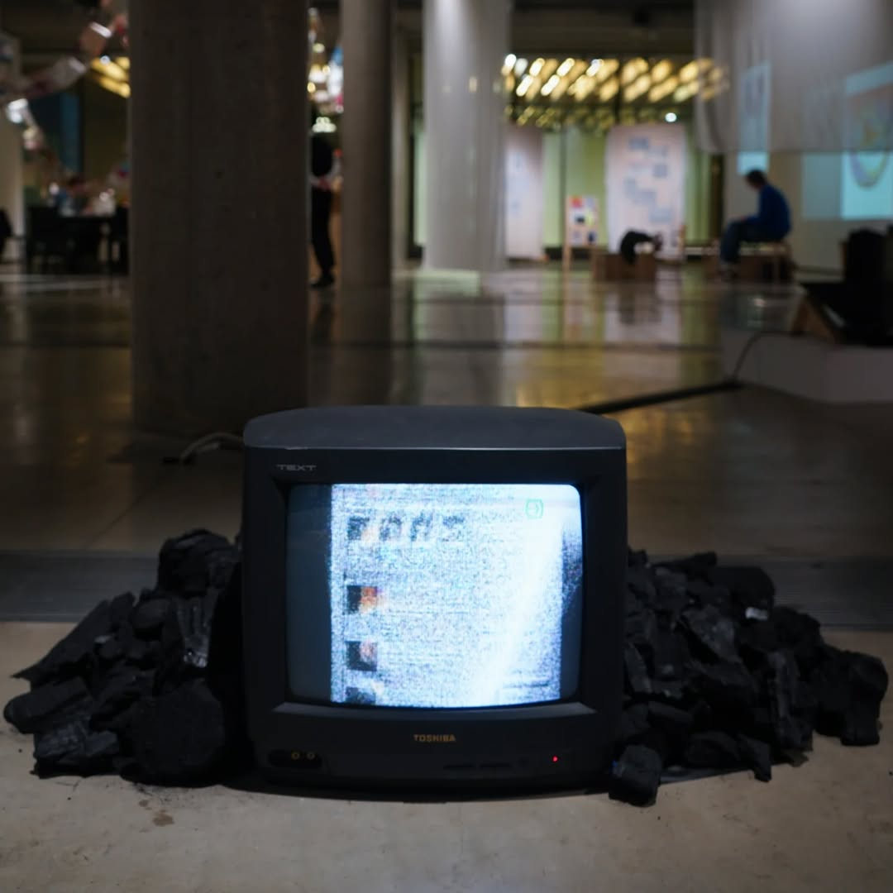

# Archive For A Dead Internet

Archive for a Dead Internet is a digital art piece that interrogates the fragility of online preservation. Created in collaboration with Ilia Pavlov, the work visualizes websites hosted by the Internet Archive as decaying 3D models, rendered on the distorted screen of a vintage Sony CRT television. A particle effector transforms these digital remnants into a noise signal, mirroring the entropy of data loss—particularly in response to the Internet Archive’s legal battles, copyright strikes, and as a response to DDOS attacks on the Internet Archive in 2024.

Embedded within the abstraction are fragments of recognizable websites (including nods to early-2000s platforms like RuneScape), evoking the nostalgia and impermanence of a web increasingly subject to corporate control and erasure.

The project emerged from a brief by researchers from Masters Curation at Central Saint Martins (in partnership with the Archive of Destruction) to explore entropy within digital archiving. Using 3D modeling and glitch aesthetics through TouchDesigner, we reimagined archived websites as unstable, deteriorating objects—their data dissolving into noise. The CRT’s analog distortion was used as a hauntological motif, showing the ghosts that lie in the machines around us.

