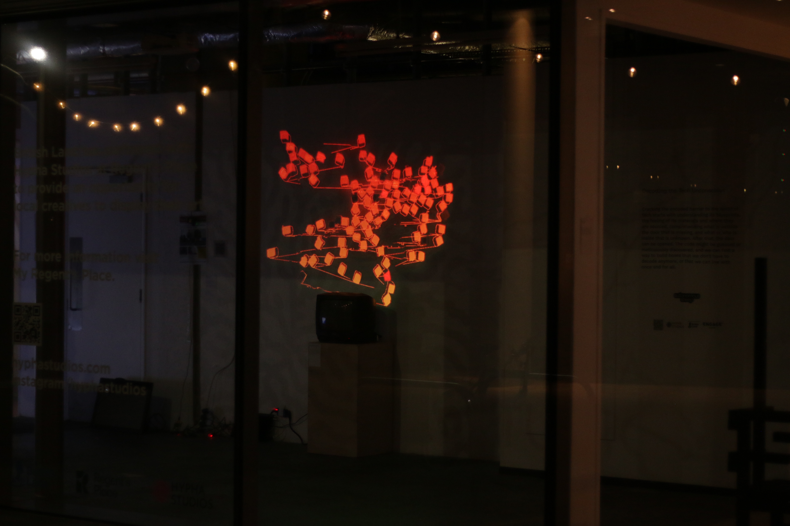

# Simulated Solidarity

Project initiated as part of masters in research into creative computing at the university of the arts london's creative computing campus in camberwell. the was displayed in Euston in London, as part of a group show with the rest of the [Autonomous Sheep](https://www.autonomous-sheep.com/) collective.

In April 2023, British technology news outlet, The Register, disclosed that the American intelligence technology corporation, Palantir, was under consideration to assist the government to break ongoing National Health Service strikes. However, the UK Government subsequently decided against employing Palantir's services, alluding prohibitive costs as the driver for this decision. Palantir's Foundry platform had been proposed for integration and had raised concerns regarding the handling of sensitive data. Notably, a project designated for "Strike Analysis" was explicitly mentioned in an official Parliamentary communique.
 
This project looks at this particular idea of simulation and how its used against communities, specifically workers as a stand in for management.

The presented project is a tool for workers to simulate the success of a unionisation ballot whilst being able to control a simulation. With it workers can derive where to best situate themselves to have conversations with their colleagues.
 
The project subverts the use of simulative tools and make something which proposes a fairer alternative.