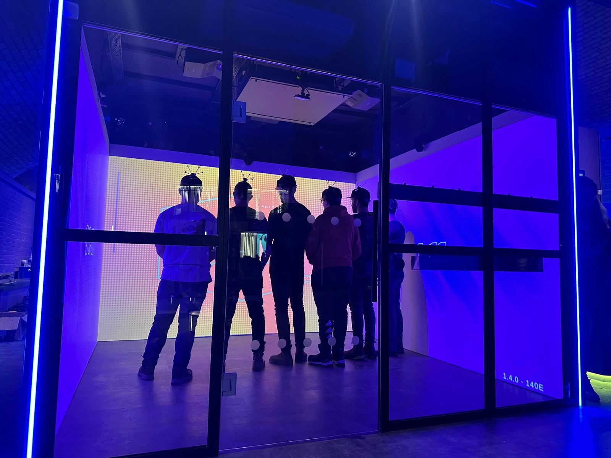
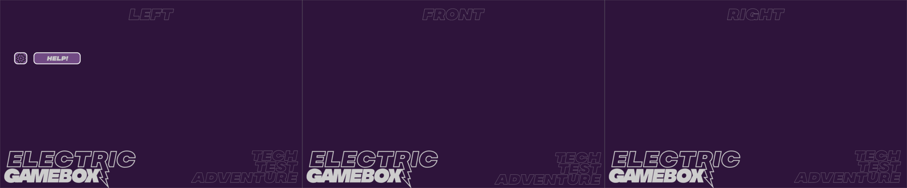

# Immersive Game Box

Worked for tech startup Immersive Game Box for 6 months taking on various responsibilities including UX Design, taking on technical support roles and putting together the physical Game Boxes 

As with all new startups, this required being very agile & wearing a lot of hats. I was simultaneously an Mixed Reality User Experience Designer using Unity, a motion capture technician, an Audio Visual tech, builder of the gamebox (the console itself) and learnt the importance of proper GitHub use.

 
Tech Test Adventure

Below is the UX design for the Tech Test Adventure which we made which was a way of teaching new on site employees how to interact with the gameboxes. Thinking about how to interact on such a large scale meant I had to wrap my head around Mixed Reality workflows, and I was introduced to the IGB Unity set up.

