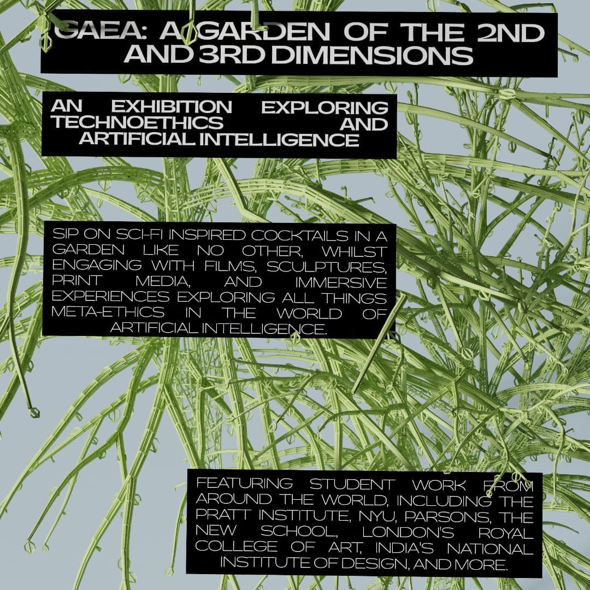
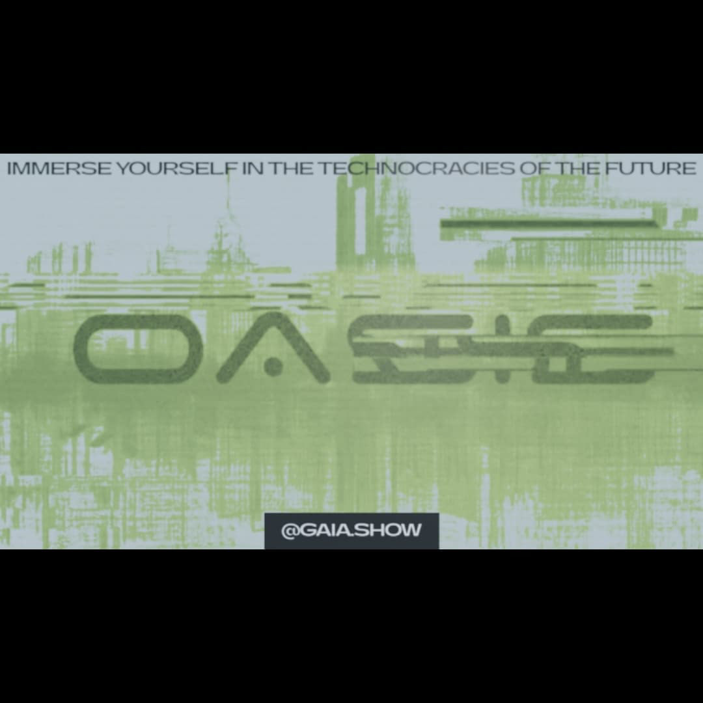

# GAEA Exhibition

Gaea was an exhibition based on Artifical Intelligence held in New York in 2021. The curator and producer of this exhibition, Luisa Charles, contacted me to create a brand identity and posters for the exhibition.

The posters were designed around a very CompArt punk aesthetic based on the early posters for Cybernetic Serendipity with an overload of text aside clean digital design.

