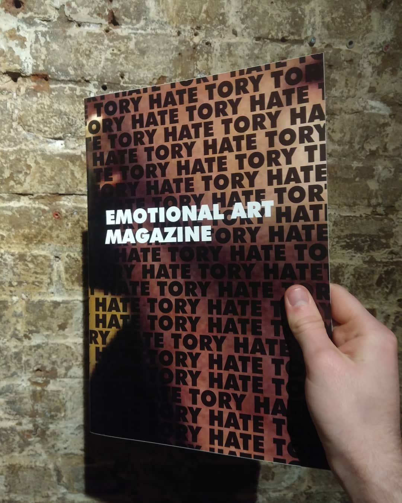

# Emotional Art Mag

Was approached by my friend Chris Hayes, the editor of an exciting new art and culture magazine called the Emotional Art Magazine to do graphic design for their first issue, named Tory Hate. The work was inherently political and the graphic design was bold and used typographic art.

There's a lot I'd do differently as the years have gone by, however I love this project, the natural feeling of working alongside a group of 20 people that involved reading groups, discussions and a political polemic.

