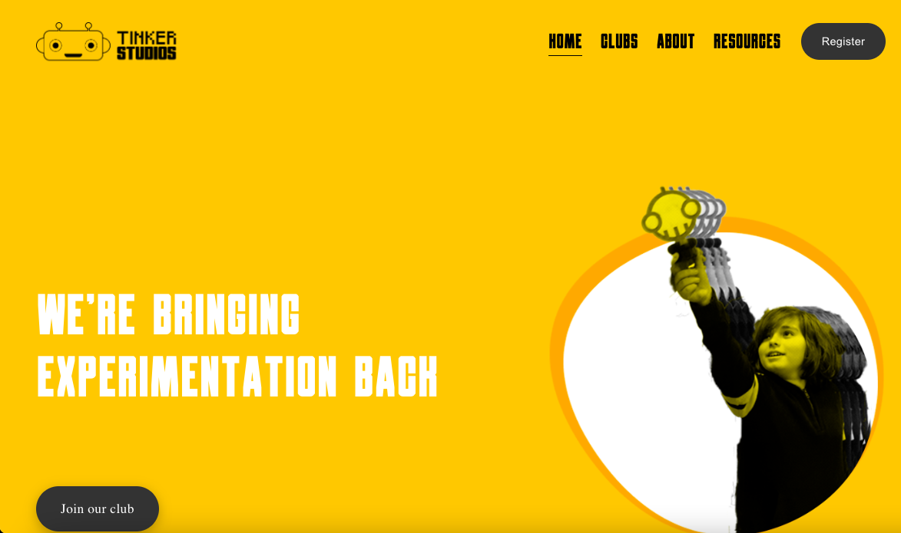

# Tinker Studios

Tinker Studios is a long term project to get young people into tech. The project began in 2019 created by founders Hemanshu Amin and myself however it has recently changed format to be a Community Interest Corporation.

Tinker Studios has been such a massive success that we can't get any of the students to leave. Of the cohort we began teaching in 2019 over half have remained, some of the students who I had been personally teaching before are now in their seventh year of learning from Heman and I. Some who are now young adults are being joining us on the teaching team.

Tinker studios has been invited to give workshops as part of the Design Museum's programmes and has been on the red carpet twice for the film Robot Dreams teaching young kids about robotics. We're due to go to Green Man festival in the summer where we'll be presenting the BBC Microbit to 300 6 to 11 year olds.

