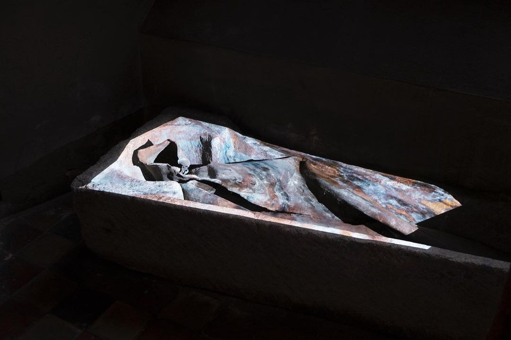
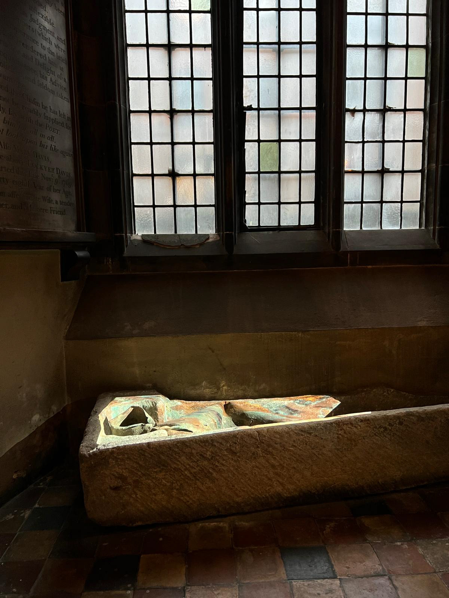

# Water Bed

I was approached by the curators behind [Eleven Twenty Three](https://www.greatstbarts.com/eleven_twenty_three/) at St Bart's Church in Farringdon to create a piece which interacted with the history of the building in celebration for the Church's 900th anniversary.

The area which I was designated was a stone coffin, the final resting place of an unnamed Prior, which had been opened during a rebuild after World War II. When the coffin was opened it was covered with a leaden shawl however the shawl showed stab marks and the corpse had been beheaded.

I used projection mapping to draw out the remaining gravestone. This involved using MadMapper and Blender to create a digital simulation of water, the aim of this to show how changes happen with the passage of time, and how water will engulf even this age old church someday.

Exhibiting in a church posed some interesting questions. I'm not particularly religious, so the idea of patronage wasn't exactly my jam, however creating artworks on an object with such a massive history gave me cause for intrigue. The team behind the exhibition are a group of friends from Goldsmiths, few of them religious either, but all of them very excited by this 900 year old building.

